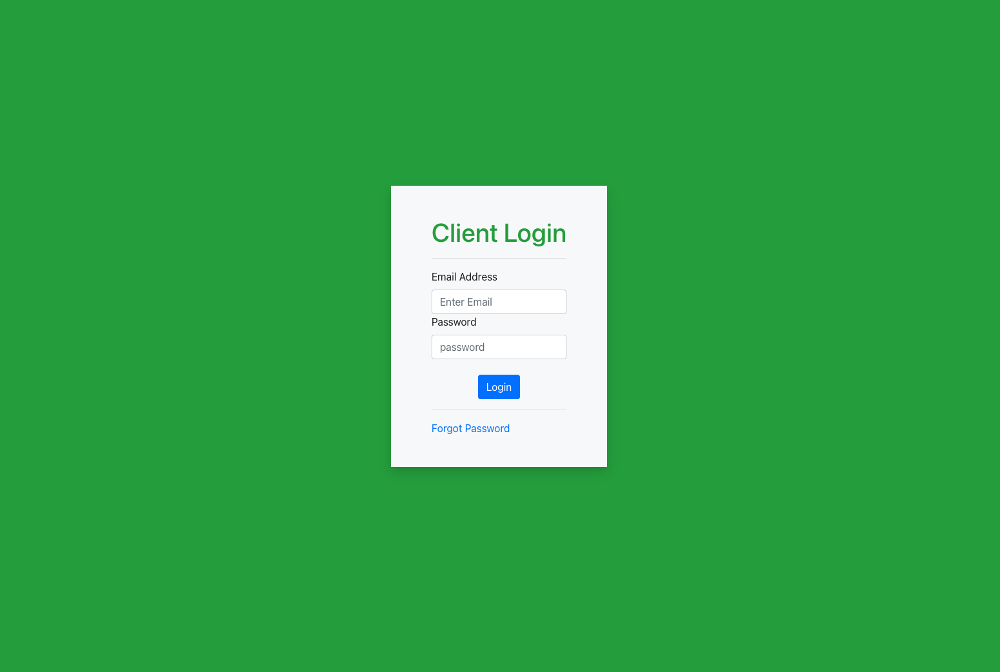
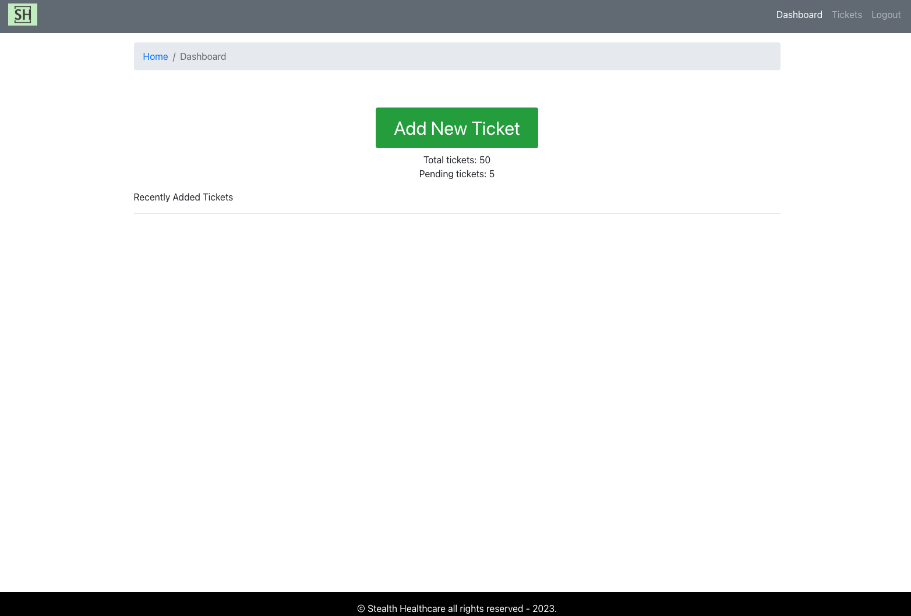
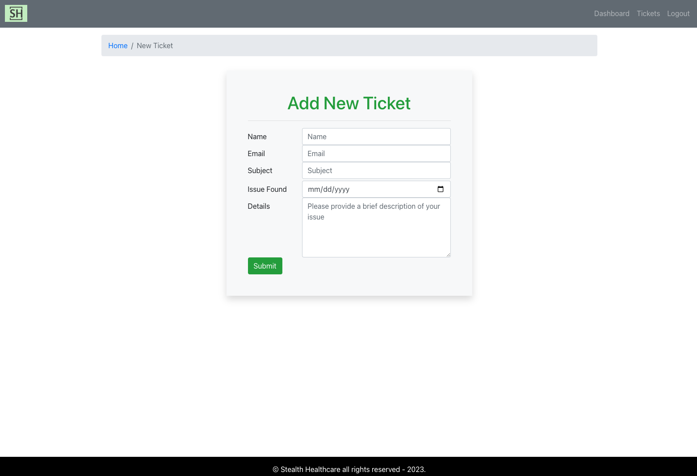
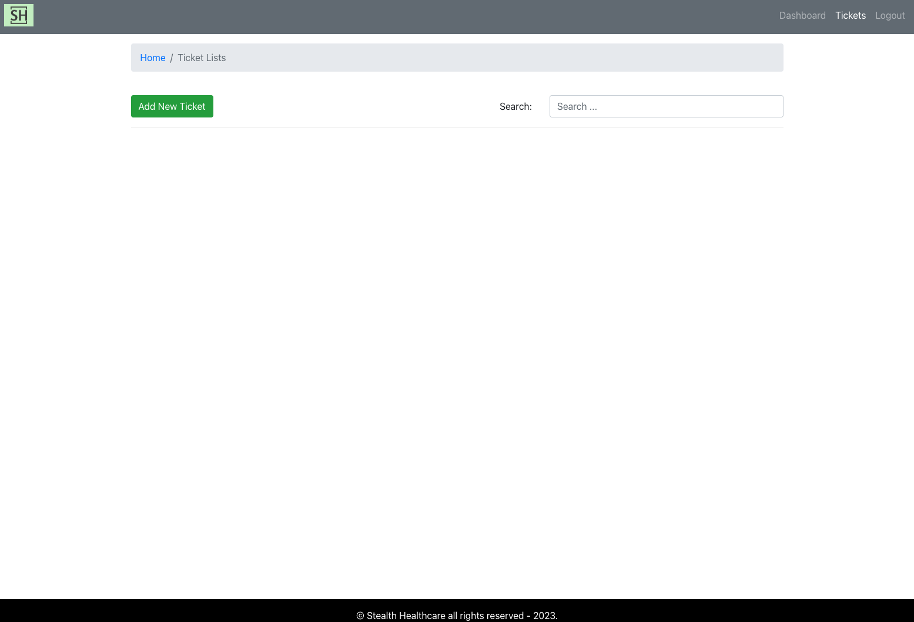
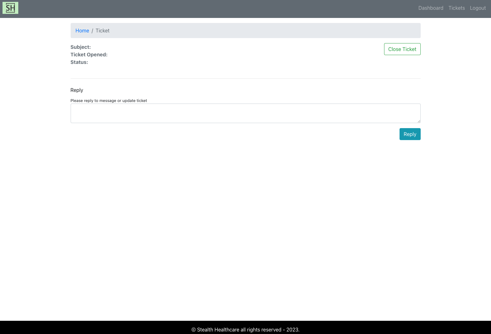

Help Desk / Ticketing System Exercise

1. Login Page

-Client must login to create and submit a ticket

2. Dashboard

-Shows recently added tickets
-Includes the total number of tickets as well as the number of pending tickets
-Button at the top to allow you to add a new ticket

3. Add New Ticket

-Allows the user to add a new ticket that must include their name, email, a subject, the issuse, as well as details about said issue.

4. Ticket List

-Allows users to view all tickets 

5. Ticket

-Allows users to reply to messages or update the ticket status